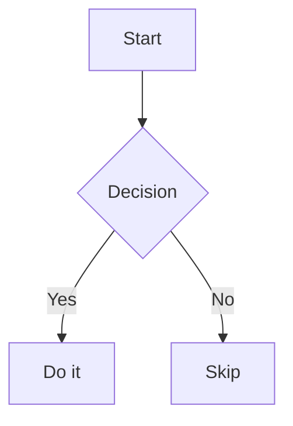

# 📖 Oxidian User Guide

> **Version 1.4.0** — The complete guide to Oxidian, the open-source Obsidian alternative built in Rust.

---

## Table of Contents

1. [Getting Started](#-getting-started)
2. [Editor Basics](#-editor-basics)
3. [Organization](#-organization)
4. [Linking & Navigation](#-linking--navigation)
5. [Remember — Knowledge Retention](#-remember--knowledge-retention)
6. [Command Palette](#-command-palette)
7. [Canvas](#-canvas)
8. [Themes & Settings](#-themes--settings)
9. [Plugins](#-plugins)
10. [Keyboard Shortcuts](#-keyboard-shortcuts)

---

## 🚀 Getting Started

### Opening a Vault

When you first launch Oxidian, you'll be prompted to **open a vault** — a folder on your computer that holds all your notes.

1. Click **Open Vault** (or use the onboarding dialog)
2. Select any folder — or create a new empty one
3. Oxidian indexes your files and you're ready to go

> 💡 A vault is just a regular folder of `.md` files. No lock-in, no proprietary format.

### Creating Your First Note

- Click the **New Note** button in the sidebar (or press `Ctrl+N`)
- Give it a name and start typing Markdown
- Your note auto-saves as you type

### The Interface

| Area | Description |
|------|-------------|
| **Left Sidebar** | File tree, search, graph, bookmarks, Remember |
| **Editor** | Main editing area (supports tabs & split panes) |
| **Right Sidebar** | Backlinks panel, properties |
| **Status Bar** | Word count, backlinks, reading time, line/column |

---

## ✏️ Editor Basics

Oxidian uses **CodeMirror 6** as its editor engine with **pulldown-cmark** for Markdown rendering.

### Markdown Syntax

| Syntax | Result |
|--------|--------|
| `# Heading 1` | Heading 1 |
| `## Heading 2` | Heading 2 |
| `**bold**` | **bold** |
| `*italic*` | *italic* |
| `~~strikethrough~~` | ~~strikethrough~~ |
| `==highlight==` | Highlighted text |
| `` `inline code` `` | `inline code` |
| `- item` | Bullet list |
| `1. item` | Numbered list |
| `- [ ] task` | Checkbox |
| `> quote` | Blockquote |
| `---` | Horizontal rule |
| `[[note]]` | Wiki-link |
| `#tag` | Tag |

### Code Blocks

Use triple backticks with a language identifier for syntax highlighting:

````
```javascript
const hello = "world";
```
````

### Callouts

```markdown
> [!note] Title
> This is a callout block.

> [!warning] Be careful
> This is a warning callout.
```

Supported types: `note`, `tip`, `warning`, `danger`, `info`, `example`, `quote`, `abstract`, `todo`, `success`, `failure`, `bug`.

### Mermaid Diagrams

````

````

### View Modes

Toggle with `Ctrl+E`:

- **Live Preview** — edit Markdown with inline rendering
- **Source Mode** — raw Markdown text
- **Reading Mode** — fully rendered, read-only view

### Frontmatter

Add YAML metadata at the top of any note:

```yaml
---
title: My Note
tags: [philosophy, reading]
date: 2026-02-10
---
```

---

## 📂 Organization

### File & Folder Tree

The left sidebar shows your vault's folder structure. Right-click for options:

- Create new note or folder
- Rename, delete, move files
- Drag & drop to reorganize

### Tags

Add tags anywhere in your notes with `#tag`. Use them to categorize across folders.

- Tags appear in search results
- Autocomplete suggests existing tags as you type (`#ph...` → `#philosophy`)

### Bookmarks ⭐

Star notes for quick access:

- Right-click a note → **Bookmark**
- Or use the Command Palette → "Toggle Bookmark"
- Access all bookmarks from the **Bookmarks** tab in the sidebar

### Daily Notes 📅

Automatically create a journal entry for today:

- Press `Ctrl+Alt+D` or click the calendar icon
- Creates a file like `2026-02-10.md` in your Daily Notes folder
- Great for journaling, standup notes, or daily logs

### Templates

Create reusable note templates:

1. Create a `Templates/` folder in your vault
2. Add `.md` files with your template content
3. When creating a new note, select **Insert Template** from the Command Palette

---

## 🔗 Linking & Navigation

### Wiki-Links

Link between notes using double brackets:

```markdown
Check out [[My Other Note]] for details.
Link to a specific heading: [[Note#Heading]]
Alias links: [[Note|Display Text]]
```

Click any wiki-link to navigate to that note. If the note doesn't exist yet, Oxidian will create it.

### Backlinks

The **Backlinks Panel** (right sidebar) shows every note that links to the current one. This helps you discover unexpected connections.

### Graph View

Open the **Graph View** from the sidebar to see your entire vault as an interactive network:

- Nodes = notes
- Edges = links between them
- Click a node to open that note
- Zoom, pan, and drag to explore

### Auto-Link Update on Rename

When you rename a file, **all wiki-links pointing to it are automatically updated** across your entire vault. No broken links.

### Navigation History

Navigate through your recently viewed notes:

- **Back:** `Ctrl+Alt+←`
- **Forward:** `Ctrl+Alt+→`

Works just like browser history.

### Hover Preview

Hover over any `[[wiki-link]]` to see a preview popup of the linked note without leaving your current document.

---

## 🧠 Remember — Knowledge Retention

The **Remember** system helps you retain what you read using spaced repetition and flashcards, inspired by Ryan Holiday's notecard system and Anki.

Access it from the **🧠 brain icon** in the left sidebar.

### Sources

Track everything you read, watch, or listen to:

1. Open Remember → **Sources** tab
2. Click **Add Source**
3. Fill in: Title, Author, Type (Book/Article/Video/Podcast), Status
4. Each source gets a literature note in the `Sources/` folder

**Status tracking:** Want to Read → Reading → Finished

### Cards (Flashcards)

Extract key ideas into atomic flashcards:

1. From a source or any note, select a highlight
2. Click **Extract to Card** (or use Command Palette)
3. Fill in the **front** (question/prompt) and **back** (answer/explanation)
4. Cards are saved as `.md` files in the `Cards/` folder

### Review (Spaced Repetition)

Oxidian uses the **SM-2 algorithm** (same as Anki) to schedule reviews:

1. Open Remember → **Review** tab
2. See how many cards are **due today**
3. Click **Start Review**
4. For each card:
   - Read the front (question)
   - Click to reveal the back (answer)
   - Rate yourself: **Again** / **Hard** / **Good** / **Easy**
5. Cards you struggle with appear more frequently

### Dashboard

The Remember dashboard shows:

- 📊 Cards due today
- 🔥 Review streak
- 📈 Retention rate
- 🎯 Daily random highlight
- 📚 Recently added sources

### Import

Bring in existing flashcards:

- Use **Remember → Import** to load cards from CSV or other formats
- Map fields to front/back/tags/source

### Smart Connections

Oxidian finds links between your cards and notes automatically, helping you build a connected knowledge base rather than isolated flashcards.

---

## ⌘ Command Palette

Press `Ctrl+P` (or `Cmd+P` on macOS) to open the **Command Palette** — your fastest way to do anything in Oxidian.

Start typing to filter commands:

- **Open note** — jump to any note by name
- **Toggle bookmark** — star/unstar the current note
- **Insert template** — apply a template
- **Toggle view mode** — switch Live Preview / Source / Reading
- **Open graph view**
- **Open daily note**
- **Toggle dark/light theme**
- And every plugin command...

> 💡 The Command Palette also shows keyboard shortcuts next to each command.

---

## 🎨 Canvas

The **Canvas** is an infinite spatial workspace for visual thinking:

- Create text cards, note cards, and media cards
- Drag, resize, and connect them with arrows
- Great for brainstorming, mind mapping, and project planning
- Access from the sidebar or Command Palette

---

## ⚙️ Themes & Settings

### Themes

- **Dark Mode / Light Mode** — toggle from settings or Command Palette
- **Custom CSS** — drop a `.css` file into your vault's `.oxidian/` folder to customize everything
- **Community Themes** — compatible with many Obsidian CSS themes

### Settings

Open settings with `Ctrl+,`:

| Category | Options |
|----------|---------|
| **Editor** | Font size, font family, line height, tab size, spell check |
| **Files** | Default location for new notes, daily notes folder, templates folder |
| **Appearance** | Theme, custom CSS, accent color |
| **Plugins** | Enable/disable, plugin settings |
| **Encryption** | Set/change vault password |
| **Updates** | Check for updates, auto-update toggle |

---

## 🧩 Plugins

Oxidian runs **real Obsidian community plugins** through a compatibility shim:

1. Open Settings → **Plugins**
2. Browse the **Plugin Explorer**
3. Click **Install** on any plugin
4. Enable it and configure in settings

### What's Supported

- ✅ Commands & Command Palette integration
- ✅ Settings tabs
- ✅ Markdown post-processing
- ✅ File events (open, save, delete)
- ✅ Vault API, Workspace API, MetadataCache

---

## ⌨️ Keyboard Shortcuts

### General

| Shortcut | Action |
|----------|--------|
| `Ctrl+N` | New note |
| `Ctrl+O` | Open file |
| `Ctrl+P` | Command Palette |
| `Ctrl+S` | Save |
| `Ctrl+W` | Close tab |
| `Ctrl+Shift+N` | New folder |
| `Ctrl+,` | Open settings |
| `Ctrl+Q` | Quit |

### Editor

| Shortcut | Action |
|----------|--------|
| `Ctrl+B` | Bold |
| `Ctrl+I` | Italic |
| `Ctrl+K` | Insert link |
| `Ctrl+E` | Toggle view mode |
| `Ctrl+D` | Delete line |
| `Ctrl+/` | Toggle comment |
| `Ctrl+Z` | Undo |
| `Ctrl+Shift+Z` | Redo |
| `Ctrl+F` | Find |
| `Ctrl+H` | Find & Replace |
| `Ctrl+L` | Select line |
| `Ctrl+Shift+K` | Delete line |
| `Alt+↑` | Move line up |
| `Alt+↓` | Move line down |
| `Ctrl+Shift+↑` | Copy line up |
| `Ctrl+Shift+↓` | Copy line down |
| `Tab` | Indent |
| `Shift+Tab` | Outdent |
| `Ctrl+]` | Indent |
| `Ctrl+[` | Outdent |

### Navigation

| Shortcut | Action |
|----------|--------|
| `Ctrl+Alt+←` | Navigate back |
| `Ctrl+Alt+→` | Navigate forward |
| `Ctrl+Alt+D` | Open daily note |
| `Ctrl+Tab` | Next tab |
| `Ctrl+Shift+Tab` | Previous tab |
| `Ctrl+1-9` | Switch to tab 1-9 |
| `Ctrl+Click` | Open link in new tab |
| `Ctrl+Shift+F` | Search vault |

### Panes

| Shortcut | Action |
|----------|--------|
| `Ctrl+\` | Split pane vertically |
| `Ctrl+Shift+\` | Split pane horizontally |

### Remember

| Shortcut | Action |
|----------|--------|
| `Ctrl+Shift+R` | Start review session |

---

## 💡 Tips & Tricks

- **Quick Switcher:** `Ctrl+P` then start typing a note name to jump to it instantly
- **Daily workflow:** Open daily note (`Ctrl+Alt+D`) → review Remember cards → start writing
- **Link everything:** The more you use `[[wiki-links]]`, the more powerful Graph View and Backlinks become
- **Use tags AND folders:** Folders for broad categories, tags for cross-cutting themes
- **Keyboard-first:** Learn the shortcuts — Oxidian is designed to keep your hands on the keyboard

---

<p align="center">
  <sub>Oxidian v1.4.0 — Made with 🦀 Rust and ☕ by machines that don't sleep</sub>
</p>
